**Data Entry**

```{r settings, include=FALSE}
ECHO_SETTING = FALSE #allows us to easily change setting in order to print all code, if necessary
INCLUDE_SETTING = FALSE #allows us to easily change setting in order to print all code, if necessary
EVAL_SETTING = FALSE #allos us to easily change setting to evalute all code, if necessary
knitr::opts_chunk$set(cache=TRUE) #cache to avoid reprocessing unchanged portion of file and speed up pdf output
```

```{r packages, include=INCLUDE_SETTING}
require(knitr)
require(stats)
require(corrplot)
require(plot3D)
require(dendextend)
```

```{r fileSetUp, include=INCLUDE_SETTING}
#Set working directory to CoralProjet
setwd("~/CoralProject")

#Create a vector to hold filenames of all DCM (medium polarity) data files
filenamesDCM = c("PAL003DCM1.csv","PAL006DCM1.csv","PAL007DCM1.csv","PAL014DCM1.csv","PAL015DCM1.csv",
              "PAL017DCM1.csv","PAL018DCM1.csv","PAL019D3.csv","PAL029DCM1.csv","PAL042D2.csv","PAL043DCM1.csv",
              "PAL044DCM1.csv","PAL045DCM1.csv","PAL048DCM1.csv","PAL050D1.csv","PAL052D1.csv",
              "PAL052D2.csv","PAL130D1.csv","PAL131D1.csv","PAL133D1.csv","PAL134D1.csv","PAL137DCM1.csv",
              "PAL227D1.csv","PAL247DCM1.csv","PAL248D1.csv","PAL250D1.csv","PAL250D2.csv","PAL252DCM1.csv",
              "PAL270D1.csv","PAL299DCM1.csv","PAL300D1.csv","PAL301D1.csv","PAL302D1.csv","PAL306D1.csv","PAL307DCM1.csv",
              "PAL332D1.csv","PAL333D1.csv","PAL334D1.csv","PAL340D1.csv","PAL355D1.csv","PAL356D1.csv","PAL359D1.csv",
              "PAL362D1.csv","PAL374DCM1.csv","PAL375D1.csv","PAL378DCM1.csv","PAL379DCM1.csv","PAL382DCM1.csv")

#Create a vector to hold filenames of all HEX ("greasy") data files
filenamesHEX = c( "PAL001HEX1.CSV", "PAL003HEX1.CSV", "PAL007HEX1.CSV", "PAL014HEX1.CSV", "PAL015HEX1.CSV",
                  "PAL017HEX1.CSV", "PAL018HEX1.CSV", "PAL019H5.CSV",   "PAL029HEX1.CSV", "PAL042H2.CSV",
                  "PAL043HEX1.CSV", "PAL044HEX1.CSV", "PAL046HEX1.CSV", "PAL048HEX1.CSV", "PAL050H1.CSV",
                  "PAL052H1.CSV",   "PAL052H2.CSV",   "PAL130H1.CSV", "PAL131H1.CSV",   "PAL133H1.CSV",
                  "PAL134H1.CSV",   "PAL137HEX1.CSV", "PAL227H1.CSV",   "PAL247HEX1.CSV","PAL248H1.CSV",
                  "PAL250H1.CSV", "PAL250H2.CSV",  "PAL252HEX1.CSV", "PAL270H1.CSV",   "PAL299HEX1.CSV",
                  "PAL300H1.CSV",   "PAL301H1.CSV", "PAL302H1.CSV",   "PAL306H1.CSV",   "PAL307HEX1.CSV",
                  "PAL332H1.CSV", "PAL333H1.CSV","PAL334H1.CSV",   "PAL340H1.CSV",   "PAL355H1.CSV",
                  "PAL356H1.CSV",   "PAL359H1.CSV",  "PAL362H1.CSV",   "PAL374HEX1.CSV", "PAL375H1.CSV",
                  "PAL378HEX1.CSV", "PAL379HEX1.CSV", "PAL382HEX1.CSV")

#set working directory to file where all DCM samples are stored
setwd("~/CoralProject/2016 Raw Data/All DCM")

#read in each dcm data file and store as a dataframe 
PAL003DCM1 = read.csv(filenamesDCM[1],header=FALSE)
PAL006DCM1 = read.csv(filenamesDCM[2],header=FALSE)
PAL007DCM1 = read.csv(filenamesDCM[3],header=FALSE)
PAL014DCM1 = read.csv(filenamesDCM[4],header=FALSE)
PAL015DCM1 = read.csv(filenamesDCM[5],header=FALSE)
PAL017DCM1 = read.csv(filenamesDCM[6],header=FALSE)
PAL018DCM1 = read.csv(filenamesDCM[7],header=FALSE)
PAL019DCM1 = read.csv(filenamesDCM[8],header=FALSE)
PAL029DCM1 = read.csv(filenamesDCM[9],header=FALSE)
PAL042DCM1 = read.csv(filenamesDCM[10],header=FALSE)
PAL043DCM1 = read.csv(filenamesDCM[11],header=FALSE)
PAL044DCM1 = read.csv(filenamesDCM[12],header=FALSE)
PAL045DCM1 = read.csv(filenamesDCM[13],header=FALSE)
PAL048DCM1 = read.csv(filenamesDCM[14],header=FALSE)
PAL050DCM1 = read.csv(filenamesDCM[15],header=FALSE)
PAL052DCM1 = read.csv(filenamesDCM[16],header=FALSE)
PAL052DCM2 = read.csv(filenamesDCM[17],header=FALSE) # DISCARDED Broad peak @ 15.8 looked less like rest of data. Use D1.
PAL130DCM1 = read.csv(filenamesDCM[18],header=FALSE)
PAL131DCM1 = read.csv(filenamesDCM[19],header=FALSE)
PAL133DCM1 = read.csv(filenamesDCM[20],header=FALSE)
PAL134DCM1 = read.csv(filenamesDCM[21],header=FALSE)
PAL137DCM1 = read.csv(filenamesDCM[22],header=FALSE)
PAL227DCM1 = read.csv(filenamesDCM[23],header=FALSE)
PAL247DCM1 = read.csv(filenamesDCM[24],header=FALSE)
PAL248DCM1 = read.csv(filenamesDCM[25],header=FALSE)
PAL250DCM1 = read.csv(filenamesDCM[26],header=FALSE)
PAL250DCM2 = read.csv(filenamesDCM[27],header=FALSE)  # DISCARDED Graph 250D2 looked the same as 052D2. Use D1.
PAL252DCM1 = read.csv(filenamesDCM[28],header=FALSE)
PAL270DCM1 = read.csv(filenamesDCM[29],header=FALSE)
PAL299DCM1 = read.csv(filenamesDCM[30],header=FALSE)
PAL300DCM1 = read.csv(filenamesDCM[31],header=FALSE)
PAL301DCM1 = read.csv(filenamesDCM[32],header=FALSE)
PAL302DCM1 = read.csv(filenamesDCM[33],header=FALSE)
PAL306DCM1 = read.csv(filenamesDCM[34],header=FALSE)
PAL307DCM1 = read.csv(filenamesDCM[35],header=FALSE)
PAL332DCM1 = read.csv(filenamesDCM[36],header=FALSE)
PAL333DCM1 = read.csv(filenamesDCM[37],header=FALSE)
PAL334DCM1 = read.csv(filenamesDCM[38],header=FALSE)
PAL340DCM1 = read.csv(filenamesDCM[39],header=FALSE)
PAL355DCM1 = read.csv(filenamesDCM[40],header=FALSE)
PAL356DCM1 = read.csv(filenamesDCM[41],header=FALSE)
PAL359DCM1 = read.csv(filenamesDCM[42],header=FALSE)
PAL362DCM1 = read.csv(filenamesDCM[43],header=FALSE)
PAL374DCM1 = read.csv(filenamesDCM[44],header=FALSE)
PAL375DCM1 = read.csv(filenamesDCM[45],header=FALSE) # DISCARDED Chromatogram indicates nothing injected - removed
PAL378DCM1 = read.csv(filenamesDCM[46],header=FALSE)
PAL379DCM1 = read.csv(filenamesDCM[47],header=FALSE)
PAL382DCM1 = read.csv(filenamesDCM[48],header=FALSE)


#set working directory to file where all HEX samples are stored
setwd("~/CoralProject/2016 Raw Data/All HEX")

#read in each HEX data file and store as a dataframe 
PAL001HEX1 = read.csv(filenamesHEX[1],header=FALSE)
PAL003HEX1 = read.csv(filenamesHEX[2],header=FALSE)
PAL007HEX1 = read.csv(filenamesHEX[3],header=FALSE)
PAL014HEX1 = read.csv(filenamesHEX[4],header=FALSE)
PAL015HEX1 = read.csv(filenamesHEX[5],header=FALSE)
PAL017HEX1 = read.csv(filenamesHEX[6],header=FALSE)
PAL018HEX1 = read.csv(filenamesHEX[7],header=FALSE)
PAL019HEX1 = read.csv(filenamesHEX[8],header=FALSE)
PAL029HEX1 = read.csv(filenamesHEX[9],header=FALSE)
PAL042HEX1 = read.csv(filenamesHEX[10],header=FALSE)
PAL043HEX1 = read.csv(filenamesHEX[11],header=FALSE)
PAL044HEX1 = read.csv(filenamesHEX[12],header=FALSE)
PAL046HEX1 = read.csv(filenamesHEX[13],header=FALSE)
PAL130HEX1 = read.csv(filenamesHEX[14],header=FALSE)
PAL131HEX1 = read.csv(filenamesHEX[15],header=FALSE)
PAL133HEX1 = read.csv(filenamesHEX[16],header=FALSE)
PAL250HEX1 = read.csv(filenamesHEX[17],header=FALSE) 
PAL250HEX2 = read.csv(filenamesHEX[18],header=FALSE) # DISCARDED Used PAL250HEX1 since graph of PAL250HEX2 less consistent with other HEX trochis 
PAL252HEX1 = read.csv(filenamesHEX[19],header=FALSE)
PAL270HEX1 = read.csv(filenamesHEX[20],header=FALSE)
PAL299HEX1 = read.csv(filenamesHEX[21],header=FALSE)
PAL332HEX1 = read.csv(filenamesHEX[22],header=FALSE)
PAL333HEX1 = read.csv(filenamesHEX[23],header=FALSE)
PAL334HEX1 = read.csv(filenamesHEX[24],header=FALSE)
PAL340HEX1 = read.csv(filenamesHEX[25],header=FALSE)
PAL355HEX1 = read.csv(filenamesHEX[26],header=FALSE)
PAL356HEX1 = read.csv(filenamesHEX[27],header=FALSE)  
PAL359HEX1 = read.csv(filenamesHEX[28],header=FALSE)
PAL362HEX1 = read.csv(filenamesHEX[29],header=FALSE)
PAL374HEX1 = read.csv(filenamesHEX[30],header=FALSE)
PAL375HEX1 = read.csv(filenamesHEX[31],header=FALSE)
PAL378HEX1 = read.csv(filenamesHEX[32],header=FALSE)
PAL379HEX1 = read.csv(filenamesHEX[33],header=FALSE)
PAL382HEX1 = read.csv(filenamesHEX[34],header=FALSE)
```

Data Notes:

- Readings occur at delta = 0.00033333333333 seconds apart
- Several of the Trocheliophorum samples were removed due to duplication or obvious corruption. See below for details: 
    + Remark that Trocheliophorum is not the main focus of this research and these samples are used mainly as a reference for the S. Glaucum clades.
- Two data files found for sample PAL052 (DCM) - discarded 2nd sample (file PAL052D2.csv) 
    + Incongruent with other DCM samples 
    + Apparently identical to 2nd sample found for sample PAL250 (DCM)
    + Broad peak @ 15.8 looked less like rest of data.
    
```{r PAL052DCM, echo=ECHO_SETTING}
par(mfrow=c(1,2))
#PAL052 DCM 1
plot(PAL052DCM1, type="l", xlab="Time", ylab="Intensity", main="PAL052 DCM 1 (Kept)")
#PAL052 DCM 2
plot(PAL052DCM2, type="l", xlab="Time", ylab="Intensity", main="PAL052 DCM 2 (Removed)")
```

\pagebreak

- Two data files found for sample PAL250 (DCM) - discarded 2nd sample (file PAL250D2.csv)
    + Incongruent with other DCM samples 
    + Apparently identical to 2nd sample found for sample PAL052 (DCM) 
    
```{r PAL250DCM, echo=ECHO_SETTING}
par(mfrow=c(1,2))
#PAL250 DCM 1
plot(PAL250DCM1, type="l", xlab="Time", ylab="Intensity", main="PAL250 DCM 1 (Kept)")
#PAL250 DCM 2
plot(PAL250DCM2, type="l", xlab="Time", ylab="Intensity", main="PAL250 DCM 2 (Removed)")

```

\pagebreak

- Two data files found for sample PAL250(HEX) - discarded 2nd sample (file PAL250H2.CSV) 
    + Incongruent with other HEX Trocheliophorum samples 
    + Choosing sample 2 is consistent with earlier choices where 2 data files found 

```{r PAL250HEX, echo=ECHO_SETTING}
par(mfrow=c(1,2))
#PAL250 HEX 1
plot(PAL250HEX1, type="l", xlab="Time", ylab="Intensity", main="PAL250 HEX 1 (Kept)")
#PAL250 HEX 2
plot(PAL250HEX2, type="l", xlab="Time", ylab="Intensity", main="PAL250 HEX 2 (Removed)")
```

\pagebreak

- Trocheliophorum Comparison Plot: PAL019 DCM and HEX 

```{r comparison, echo=ECHO_SETTING}

par(mfrow=c(1,2))
#PAL019 DCM 1 (For comparison)
plot(PAL019DCM1, type="l", xlab="Time", ylab="Intensity", main="PAL019 DCM 1")
#PAL019 HEX 1 (For comparison)
plot(PAL019HEX1, type="l", xlab="Time", ylab="Intensity", main="PAL019 HEX 1")
```

\pagebreak

- Chromatogram of sample PAL375 (DCM) indicates that nothing was injected and was discarded (file PAL375D1.csv)

```{r PAL375DCM, echo=ECHO_SETTING}
par(mfrow=c(1,1))
plot(PAL375DCM1, type="l", xlab="Time", ylab="Intensity", main= "PAL375 DCM 1")
```


```{r timelineupvectors, include=INCLUDE_SETTING}
initialDCMTimes = c(PAL003DCM1[1,1], PAL006DCM1[1,1], PAL007DCM1[1,1], PAL014DCM1[1,1], 
                PAL015DCM1[1,1], PAL017DCM1[1,1], PAL018DCM1[1,1], PAL019DCM1[1,1], 
                PAL029DCM1[1,1], PAL042DCM1[1,1], PAL043DCM1[1,1], PAL044DCM1[1,1], 
                PAL045DCM1[1,1], PAL048DCM1[1,1], PAL050DCM1[1,1], PAL052DCM1[1,1], 
                PAL130DCM1[1,1], PAL131DCM1[1,1], PAL133DCM1[1,1], PAL134DCM1[1,1], 
                PAL137DCM1[1,1], PAL227DCM1[1,1], PAL247DCM1[1,1], PAL248DCM1[1,1],
                PAL250DCM1[1,1], PAL252DCM1[1,1], PAL270DCM1[1,1], PAL299DCM1[1,1], 
                PAL300DCM1[1,1], PAL301DCM1[1,1], PAL302DCM1[1,1], PAL306DCM1[1,1], 
                PAL307DCM1[1,1], PAL332DCM1[1,1], PAL333DCM1[1,1], PAL334DCM1[1,1], 
                PAL340DCM1[1,1], PAL355DCM1[1,1], PAL356DCM1[1,1], PAL359DCM1[1,1], 
                PAL362DCM1[1,1], PAL374DCM1[1,1], PAL378DCM1[1,1], PAL379DCM1[1,1], PAL382DCM1[1,1])
                
finalDCMTimes = c(PAL003DCM1[nrow(PAL003DCM1),1], PAL006DCM1[nrow(PAL006DCM1),1], 
                  PAL007DCM1[nrow(PAL007DCM1),1], PAL014DCM1[nrow(PAL014DCM1),1], 
                  PAL015DCM1[nrow(PAL015DCM1),1], PAL017DCM1[nrow(PAL017DCM1),1], 
                  PAL018DCM1[nrow(PAL018DCM1),1], PAL019DCM1[nrow(PAL019DCM1),1], 
                  PAL029DCM1[nrow(PAL029DCM1),1], PAL042DCM1[nrow(PAL042DCM1),1], 
                  PAL043DCM1[nrow(PAL043DCM1),1], PAL044DCM1[nrow(PAL044DCM1),1], 
                  PAL045DCM1[nrow(PAL045DCM1),1], PAL048DCM1[nrow(PAL048DCM1),1], 
                  PAL050DCM1[nrow(PAL050DCM1),1], PAL052DCM1[nrow(PAL052DCM1),1], 
                  PAL130DCM1[nrow(PAL130DCM1),1], PAL131DCM1[nrow(PAL131DCM1),1], 
                  PAL133DCM1[nrow(PAL133DCM1),1], PAL134DCM1[nrow(PAL134DCM1),1], 
                  PAL137DCM1[nrow(PAL137DCM1),1], PAL227DCM1[nrow(PAL227DCM1),1], 
                  PAL247DCM1[nrow(PAL247DCM1),1], PAL248DCM1[nrow(PAL248DCM1),1],
                  PAL250DCM1[nrow(PAL250DCM1),1], PAL252DCM1[nrow(PAL252DCM1),1], 
                  PAL270DCM1[nrow(PAL270DCM1),1], PAL299DCM1[nrow(PAL299DCM1),1], 
                  PAL300DCM1[nrow(PAL300DCM1),1], PAL301DCM1[nrow(PAL301DCM1),1], 
                  PAL302DCM1[nrow(PAL302DCM1),1], PAL306DCM1[nrow(PAL306DCM1),1], 
                  PAL307DCM1[nrow(PAL307DCM1),1], PAL332DCM1[nrow(PAL332DCM1),1], 
                  PAL333DCM1[nrow(PAL333DCM1),1], PAL334DCM1[nrow(PAL334DCM1),1], 
                  PAL340DCM1[nrow(PAL340DCM1),1], PAL355DCM1[nrow(PAL355DCM1),1], 
                  PAL356DCM1[nrow(PAL356DCM1),1], PAL359DCM1[nrow(PAL359DCM1),1], 
                  PAL362DCM1[nrow(PAL362DCM1),1], PAL374DCM1[nrow(PAL374DCM1),1], 
                  PAL378DCM1[nrow(PAL378DCM1),1], PAL379DCM1[nrow(PAL379DCM1),1], 
                  PAL382DCM1[nrow(PAL382DCM1),1])

DCMTime77001 = c(PAL003DCM1[77001,1], PAL006DCM1[77001,1], PAL007DCM1[77001,1], PAL014DCM1[77001,1], 
                    PAL015DCM1[77001,1], PAL017DCM1[77001,1], PAL018DCM1[77001,1], PAL019DCM1[77001,1], 
                    PAL029DCM1[77001,1], PAL042DCM1[77001,1], PAL043DCM1[77001,1], PAL044DCM1[77001,1], 
                    PAL045DCM1[77001,1], PAL048DCM1[77001,1], PAL050DCM1[77001,1], PAL052DCM1[77001,1], 
                    PAL130DCM1[77001,1], PAL131DCM1[77001,1], PAL133DCM1[77001,1], PAL134DCM1[77001,1], 
                    PAL137DCM1[77001,1], PAL227DCM1[77001,1], PAL247DCM1[77001,1], PAL248DCM1[77001,1],
                    PAL250DCM1[77001,1], PAL252DCM1[77001,1], PAL270DCM1[77001,1], PAL299DCM1[77001,1], 
                    PAL300DCM1[77001,1], PAL301DCM1[77001,1], PAL302DCM1[77001,1], PAL306DCM1[77001,1], 
                    PAL307DCM1[77001,1], PAL332DCM1[77001,1], PAL333DCM1[77001,1], PAL334DCM1[77001,1], 
                    PAL340DCM1[77001,1], PAL355DCM1[77001,1], PAL356DCM1[77001,1], PAL359DCM1[77001,1], 
                    PAL362DCM1[77001,1], PAL374DCM1[77001,1], PAL378DCM1[77001,1], PAL379DCM1[77001,1],
                    PAL382DCM1[77001,1])
```

- Some readings originally had 77,002 time points while others had 77,001
    + We omit the last time point and align based on the initial time which begin at approximately 1 minute
        - We observe that the standard deviation is greater among the final time points than among either           the initial time points or the 77001th time points, and conclude that the samples start at                 approximately the same time, but some extend for an extra time point. 
        
```{r timelineupstats}
sd(initialDCMTimes) #standard deviation of initial time point for each sample
sd(DCMTime77001) #standard deviation of 77001st time point for each sample
sd(finalDCMTimes) #standard deviation of final time point for each sample
```

\pagebreak

Number of DCM ("medium polarity") Samples of Each Type: 

Species            | Count
------------------ | ------------------
S.glaucum Clade F  | 24
S.glaucum Clade D  | 10
Trocheliophorum    | 11
Total              | 45

Number of Hexane ("greasy") Samples of Each Type: 

Species            | Count
------------------ | ------------------
S.glaucum Clade F  | 18
S.glaucum Clade D  | 8
Trocheliophorum    | 7
Total              | 33

\

```{r dataformatting, include=INCLUDE_SETTING}
TRUNC_BEGIN = 1 #first data point to use
TRUNC_END = 77001 #second data point to use
DELTA = 0.00033333333333 #Time increment by which intensity is measured (in minutes)

#combine DCM data into one dataframe so that each row is one sample
# first three columns give information about the sample
# the following columns give instrument readings for "intensity" at a given time point (77001 time points)
dfAllT_DCM = rbind(
  #S. glaucum clade F - 24
  c(003,"DCM","F", as.numeric(PAL003DCM1[TRUNC_BEGIN:TRUNC_END, 2])),
  c(006,"DCM","F", as.numeric(PAL006DCM1[TRUNC_BEGIN:TRUNC_END, 2])),
  c(007,"DCM","F", as.numeric(PAL007DCM1[TRUNC_BEGIN:TRUNC_END, 2])),
  c(014,"DCM","F", as.numeric(PAL014DCM1[TRUNC_BEGIN:TRUNC_END, 2])),
  c(015,"DCM","F", as.numeric(PAL015DCM1[TRUNC_BEGIN:TRUNC_END, 2])),
  c(017,"DCM","F", as.numeric(PAL017DCM1[TRUNC_BEGIN:TRUNC_END, 2])),
  c(018,"DCM","F", as.numeric(PAL018DCM1[TRUNC_BEGIN:TRUNC_END, 2])),
  c(043,"DCM","F", as.numeric(PAL043DCM1[TRUNC_BEGIN:TRUNC_END, 2])),
  c(044,"DCM","F", as.numeric(PAL044DCM1[TRUNC_BEGIN:TRUNC_END, 2])),
  c(048,"DCM","F", as.numeric(PAL048DCM1[TRUNC_BEGIN:TRUNC_END, 2])),
  c(050,"DCM","F", as.numeric(PAL050DCM1[TRUNC_BEGIN:TRUNC_END, 2])),
  c(130,"DCM","F", as.numeric(PAL130DCM1[TRUNC_BEGIN:TRUNC_END, 2])),
  c(131,"DCM","F", as.numeric(PAL131DCM1[TRUNC_BEGIN:TRUNC_END, 2])),
  c(133,"DCM","F", as.numeric(PAL133DCM1[TRUNC_BEGIN:TRUNC_END, 2])),
  c(134,"DCM","F", as.numeric(PAL134DCM1[TRUNC_BEGIN:TRUNC_END, 2])),
  c(248,"DCM","F", as.numeric(PAL248DCM1[TRUNC_BEGIN:TRUNC_END, 2])),
  c(270,"DCM","F", as.numeric(PAL270DCM1[TRUNC_BEGIN:TRUNC_END, 2])),
  c(302,"DCM","F", as.numeric(PAL302DCM1[TRUNC_BEGIN:TRUNC_END, 2])),
  c(333,"DCM","F", as.numeric(PAL333DCM1[TRUNC_BEGIN:TRUNC_END, 2])),
  c(334,"DCM","F", as.numeric(PAL334DCM1[TRUNC_BEGIN:TRUNC_END, 2])),
  c(374,"DCM","F", as.numeric(PAL374DCM1[TRUNC_BEGIN:TRUNC_END, 2])),
  c(378,"DCM","F", as.numeric(PAL378DCM1[TRUNC_BEGIN:TRUNC_END, 2])),
  c(382,"DCM","F", as.numeric(PAL382DCM1[TRUNC_BEGIN:TRUNC_END, 2])),
  c(227,"DCM","F", as.numeric(PAL227DCM1[TRUNC_BEGIN:TRUNC_END, 2])),
  
  #S. glaucum clade D - 10
  c(029,"DCM","D", as.numeric(PAL029DCM1[TRUNC_BEGIN:TRUNC_END, 2])),
  c(247,"DCM","D", as.numeric(PAL247DCM1[TRUNC_BEGIN:TRUNC_END, 2])),
  c(252,"DCM","D", as.numeric(PAL252DCM1[TRUNC_BEGIN:TRUNC_END, 2])),
  c(299,"DCM","D", as.numeric(PAL299DCM1[TRUNC_BEGIN:TRUNC_END, 2])),
  c(300,"DCM","D", as.numeric(PAL300DCM1[TRUNC_BEGIN:TRUNC_END, 2])),
  c(306,"DCM","D", as.numeric(PAL306DCM1[TRUNC_BEGIN:TRUNC_END, 2])),
  c(332,"DCM","D", as.numeric(PAL332DCM1[TRUNC_BEGIN:TRUNC_END, 2])),
  c(340,"DCM","D", as.numeric(PAL340DCM1[TRUNC_BEGIN:TRUNC_END, 2])),
  c(355,"DCM","D", as.numeric(PAL355DCM1[TRUNC_BEGIN:TRUNC_END, 2])),
  c(359,"DCM","D", as.numeric(PAL359DCM1[TRUNC_BEGIN:TRUNC_END, 2])),
  
  #Trocheliophorum - 11
  c(019,"DCM","T", as.numeric(PAL019DCM1[TRUNC_BEGIN:TRUNC_END, 2])),
  c(042,"DCM","T", as.numeric(PAL042DCM1[TRUNC_BEGIN:TRUNC_END, 2])),
  c(045,"DCM","T", as.numeric(PAL045DCM1[TRUNC_BEGIN:TRUNC_END, 2])),
  c(052,"DCM","T", as.numeric(PAL052DCM1[TRUNC_BEGIN:TRUNC_END, 2])),
  c(137,"DCM","T", as.numeric(PAL137DCM1[TRUNC_BEGIN:TRUNC_END, 2])),
  c(250,"DCM","T", as.numeric(PAL250DCM1[TRUNC_BEGIN:TRUNC_END, 2])),
  c(301,"DCM","T", as.numeric(PAL301DCM1[TRUNC_BEGIN:TRUNC_END, 2])),
  c(307,"DCM","T", as.numeric(PAL307DCM1[TRUNC_BEGIN:TRUNC_END, 2])),
  c(356,"DCM","T", as.numeric(PAL356DCM1[TRUNC_BEGIN:TRUNC_END, 2])),
  c(362,"DCM","T", as.numeric(PAL362DCM1[TRUNC_BEGIN:TRUNC_END, 2])),
  c(379,"DCM","T", as.numeric(PAL379DCM1[TRUNC_BEGIN:TRUNC_END, 2]))
)

#combine HEX data into one dataframe so that each row is one sample
# first three columns give information about the sample
# the following columns give instrument readings for "intensity" at a given time point (77001 time points)
dfAllT_HEX = rbind(
  #S. glaucum clade F - 18
  c(001, "HEX", "F", as.numeric(PAL001HEX1[TRUNC_BEGIN:TRUNC_END, 2])),
  c(003, "HEX", "F", as.numeric(PAL003HEX1[TRUNC_BEGIN:TRUNC_END, 2])),
  c(007, "HEX", "F", as.numeric(PAL007HEX1[TRUNC_BEGIN:TRUNC_END, 2])),
  c(014, "HEX", "F", as.numeric(PAL014HEX1[TRUNC_BEGIN:TRUNC_END, 2])),
  c(015, "HEX", "F", as.numeric(PAL015HEX1[TRUNC_BEGIN:TRUNC_END, 2])),
  c(017, "HEX", "F", as.numeric(PAL017HEX1[TRUNC_BEGIN:TRUNC_END, 2])),
  c(018, "HEX", "F", as.numeric(PAL018HEX1[TRUNC_BEGIN:TRUNC_END, 2])),
  c(043, "HEX", "F", as.numeric(PAL043HEX1[TRUNC_BEGIN:TRUNC_END, 2])),
  c(044, "HEX", "F", as.numeric(PAL044HEX1[TRUNC_BEGIN:TRUNC_END, 2])),
  c(130, "HEX", "F", as.numeric(PAL130HEX1[TRUNC_BEGIN:TRUNC_END, 2])),
  c(131, "HEX", "F", as.numeric(PAL131HEX1[TRUNC_BEGIN:TRUNC_END, 2])),
  c(133, "HEX", "F", as.numeric(PAL133HEX1[TRUNC_BEGIN:TRUNC_END, 2])),
  c(270, "HEX", "F", as.numeric(PAL270HEX1[TRUNC_BEGIN:TRUNC_END, 2])),
  c(333, "HEX", "F", as.numeric(PAL333HEX1[TRUNC_BEGIN:TRUNC_END, 2])),
  c(334, "HEX", "F", as.numeric(PAL334HEX1[TRUNC_BEGIN:TRUNC_END, 2])),
  c(374, "HEX", "F", as.numeric(PAL374HEX1[TRUNC_BEGIN:TRUNC_END, 2])),
  c(378, "HEX", "F", as.numeric(PAL378HEX1[TRUNC_BEGIN:TRUNC_END, 2])), 
  c(382, "HEX", "F", as.numeric(PAL382HEX1[TRUNC_BEGIN:TRUNC_END, 2])),
  
  #S. glaucum clade D - 8
  c(029, "HEX", "D", as.numeric(PAL029HEX1[TRUNC_BEGIN:TRUNC_END, 2])),
  c(046, "HEX", "D", as.numeric(PAL046HEX1[TRUNC_BEGIN:TRUNC_END, 2])),
  c(252, "HEX", "D", as.numeric(PAL252HEX1[TRUNC_BEGIN:TRUNC_END, 2])),
  c(299, "HEX", "D", as.numeric(PAL299HEX1[TRUNC_BEGIN:TRUNC_END, 2])),
  c(332, "HEX", "D", as.numeric(PAL332HEX1[TRUNC_BEGIN:TRUNC_END, 2])),
  c(340, "HEX", "D", as.numeric(PAL340HEX1[TRUNC_BEGIN:TRUNC_END, 2])),
  c(355, "HEX", "D", as.numeric(PAL355HEX1[TRUNC_BEGIN:TRUNC_END, 2])),
  c(359, "HEX", "D", as.numeric(PAL359HEX1[TRUNC_BEGIN:TRUNC_END, 2])),
  
  
  #Trocheliophorum - 7
  c(019, "HEX", "T", as.numeric(PAL019HEX1[TRUNC_BEGIN:TRUNC_END, 2])),
  c(042, "HEX", "T", as.numeric(PAL042HEX1[TRUNC_BEGIN:TRUNC_END, 2])),
  c(250, "HEX", "T", as.numeric(PAL250HEX1[TRUNC_BEGIN:TRUNC_END, 2])),
  c(356, "HEX", "T", as.numeric(PAL356HEX1[TRUNC_BEGIN:TRUNC_END, 2])),
  c(362, "HEX", "T", as.numeric(PAL362HEX1[TRUNC_BEGIN:TRUNC_END, 2])),
  c(375, "HEX", "T", as.numeric(PAL375HEX1[TRUNC_BEGIN:TRUNC_END, 2])), 
  c(379, "HEX", "T", as.numeric(PAL379HEX1[TRUNC_BEGIN:TRUNC_END, 2]))
)

#generate column name vector for the dataframe 
names <- function(){
  nameVec = c(TRUNC_BEGIN:TRUNC_END)
  nameVec = as.character(nameVec)
  
  for(i in TRUNC_BEGIN:TRUNC_END){
    nameVec[i] = paste("t", nameVec[i], sep="")
  }
  
  nameVec = c("Sample", "Greasiness", "Clade", nameVec)
  return(nameVec)
}
colNames = names()
colnames(dfAllT_DCM) <- colNames
colnames(dfAllT_HEX) <- colNames
```


```{r, echo=ECHO_SETTING}
kable(dfAllT_DCM[1:5, 1:5], caption="Snapshot of All Time Points Dataframe (DCM)")
```


```{r, echo=ECHO_SETTING}
kable(dfAllT_HEX[1:5, 1:5], caption="Snapshot of All Time Points Dataframe (HEX)")
```

\pagebreak

**Gas Chromatograms - Clade F (DCM)** \
  \
  \
  \
  \
  \
  \
  \
  \
  \
   \
   \
  \
  \
  \
  \
  \
  \
  \
  \
  \
  \
  \
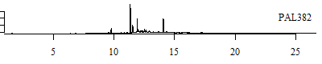  \
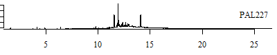  \

\pagebreak

**Gas Chromatograms - Clade D (DCM)** \
  \
  \
  \
  \
  \
  \
  \
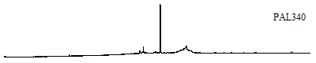  \
  \
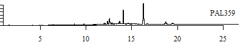   \

\pagebreak

**Gas Chromatograms - Trocheliophorum (DCM)** \
  \
  \
  \
  \
  \
  \
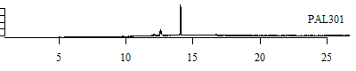  \
  \
  \
   \
  

\pagebreak

**Gas Chromatograms - Clade F (HEX)** \
  \
  \
  \
  \
  \
  \
  \
  \
  \
  \
  \
  \
  \
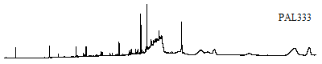  \
  \
  \
  \
  \

\pagebreak

**Gas Chromatograms - Clade D (HEX)** \
\
  \
  \
  \
  \
  \
  \
  \
   \


\pagebreak

**Gas Chromatograms - Trocheliophorum (HEX)** \
  \
  \
  \
  \
   \
   \
   

\pagebreak

**Truncated Normalized Trapezoidal Areas**

Note:

* We omit the first 15000 time points (about 5 minutes) where there is little activity
* We omit the last 15002 time points (about 5 minutes) where there is little activity

\
```{r trapnormarea}
#computes the trapezoidal area of each time interval in the given vector using the delta as the height and the intensity readings of two successive rows as the side lengths
trap <- function(intens, delta) { 
  intens1 <- rep(intens)
  intens1 = intens1[-1]
  intens = intens[1:length(intens)-1]
  trapArea = (intens + intens1)*delta/2
  return(c(as.numeric(trapArea), 0))
}

#normalizes the vector input so that the total area adds to 1
norm <- function(trapArea){
  tot = sum(trapArea)
  return(trapArea/tot)
}

#We omit the first and last 15000 time observations (5 minutes) because there is little observed activity during those time intervals.
TRUNC_BEGIN = 15003
TRUNC_END = 62002

#Process as dataframe - CHANGE TO AS.NUMERIC
dfDCM_area = dfAllT_DCM[,TRUNC_BEGIN:TRUNC_END]
for(i in 1:nrow(dfDCM_area)){
  dfDCM_area[i, ] = norm(trap(as.numeric(dfDCM_area[i, ]), DELTA))
}
rownames(dfDCM_area) = dfAllT_DCM[,1]

dfHEX_area = dfAllT_HEX[,TRUNC_BEGIN:TRUNC_END]
for(i in 1:nrow(dfHEX_area)){
  dfHEX_area[i, ] = norm(trap(as.numeric(dfHEX_area[i, ]), DELTA))
}
rownames(dfHEX_area) = dfAllT_HEX[,1]
```

```{r displayNormTrap, include=INCLUDE_SETTING}
kable(dfDCM_area[1:5, 1:4], digits=5, caption="Snapshot of Normalized Trapezoidal Area Dataframe (DCM)")
kable(dfHEX_area[1:5, 1:4], caption="Snapshot of Normalized Trapezoidal Area Dataframe (HEX)", digits=5)
```

**Binned Areas**

```{r binarea}
#returns a binned matrix whose bins are the sums of the areas df for each bin interval
#each bin has as many time intervals as specified by binWidth 
#any remainder from ncol(df)/binwidth will not be included in the binned matrix
binner <- function(df, binWidth, delta) {
  rowz = c()
  for(j in 1:nrow(df)) {
    col = c()
    for(i in seq(1, ncol(df)-binWidth, binWidth)){
      end = min(ncol(df),i + binWidth - 1)
      col = c(col, sum(as.numeric(df[j,i:end])))
    }
    rowz = rbind(rowz, col)
  }
  
  return(rowz)
}

binned_matrix_DCM = binner(dfDCM_area, 1100, DELTA)
bins = 1:ncol(binned_matrix_DCM)
for (i in 1:ncol(binned_matrix_DCM)){
  bins[i] = paste("Bin", as.character(i))
}
dimnames(binned_matrix_DCM) = list(dfAllT_DCM[,1], bins)

binned_matrix_HEX = binner(dfHEX_area, 1100, DELTA)
dimnames(binned_matrix_HEX) = list(dfAllT_HEX[,1], bins)
```

```{r displaybinned, echo=ECHO_SETTING}
#display table of binned_matrix_DCM
kable(binned_matrix_DCM[1:5, 1:5])

#display table of binned_matrix_HEX
kable(binned_matrix_HEX[1:5, 1:5])
```

\pagebreak

**Gas Chromatograms (Truncated and Showing Bins) - Clade F (DCM)** \
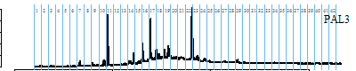  \
  \
  \
  \
  \
  \
  \
  \
  \
   \
   \
  \
  \
  \
  \
  \
  \
  \
  \
  \
  \
  \
  \
  \

\pagebreak

**Gas Chromatograms (Truncated and Showing Bins) - Clade D (DCM)** \
  \
  \
  \
  \
  \
  \
  \
  \
  \
   \


\pagebreak

**Gas Chromatograms (Truncated and Showing Bins) - Trocheliophorum (DCM)** \
  \
  \
  \
  \
  \
  \
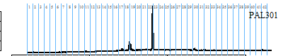  \
  \
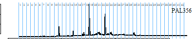  \
   \
  

\pagebreak

**Gas Chromatograms (Truncated and Showing Bins) - Clade F (HEX)** \
  \
  \
  \
  \
  \
  \
  \
  \
  \
  \
  \
  \
  \
  \
  \
  \
  \
  \

\pagebreak

**Gas Chromatograms (Truncated and Showing Bins) - Clade D (HEX)** \
\
  \
  \
  \
  \
  \
  \
  \
   \

\pagebreak

**Gas Chromatograms (Truncated and Showing Bins) - Trocheliophorum (HEX)** \
  \
  \
  \
  \
   \
   \
   

\pagebreak

**Gas Binned Barplots - Clade F (DCM)** \
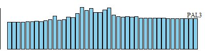  \
  \
  \
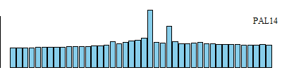  \
  \
  \
  \
  \
  \
   \
   \
  \
  \
  \
  \
  \
  \
  \
  \
  \
  \
  \
  \
  \

\pagebreak

**Gas Binned Barplots - Clade D (DCM)** \
  \
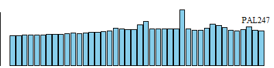  \
  \
  \
  \
  \
  \
  \
  \
   \

\pagebreak

**Gas Binned Barplots - Trocheliophorum (DCM)** \
  \
  \
  \
  \
  \
  \
  \
  \
  \
   \
  

\pagebreak

**Gas Binned Barplots - Clade F (HEX)** \
  \
  \
  \
  \
  \
  \
  \
  \
  \
  \
  \
  \
  \
  \
  \
  \
  \
  \

\pagebreak

**Gas Binned Barplots - Clade D (HEX)** \
  \
  \
  \
  \
  \
  \
  \
   \

\pagebreak

**Gas Binned Barplots - Trocheliophorum (HEX)** \
  \
  \
  \
  \
   \
   \
   \

\pagebreak

**Principal Components Analysis (PCA)**

As a descriptive measure, we examine the correlation between the bins we use as our explanatory variables. 

```{r bincorrelation, echo=ECHO_SETTING}
par(mar=c(4.1, 4.1, 5.1, 2.1))
#correlation matrix between DCM bins
corrplot(cor(binned_matrix_DCM, binned_matrix_DCM), type="lower", main="DCM Bin Correlations")

#correlation matrix between HEX bins
corrplot(cor(binned_matrix_HEX, binned_matrix_HEX), type="lower", main="HEX Bin Correlations")
```

Because we see that there are fairly high correlations between bins in several regions of both correlation plots, we have reason to believe that PCA might be appropriate. 

We proceed by validating the assumptions of PCA (as outlined in the Princeton Tutorial on Principal Component Analysis listed below).

*Normal Distribution of Explanatory Variables* /
QQ plots indicate that the explanatory variables are not normally distributed, which violates one PCA assumption. We show some of these non-normal QQ plots below as examples. PCA tends to be fairly robust to such assumptions, so we proceed cautiously with the analysis. 

```{r qqplots, echo=ECHO_SETTING}
#qqplot of bin to test normality of independent variables assumption? - did a few not great? 
par(mfrow=c(2,2))
for(i in c(25, 26, 29, 35)) {
  qqnorm(binned_matrix_DCM[,i], main=paste("Bin", as.character(i), "(DCM)"))
  qqline(binned_matrix_DCM[,i])
}

par(mfrow=c(2,2))
for(i in c(35, 34, 23, 27)) {
  qqnorm(binned_matrix_HEX[,i], main=paste("Bin", as.character(i), " (HEX)"))
  qqline(binned_matrix_HEX[,i])
}

par(mfrow=c(1,1))
```

*LINEARITY ASSUMPTION?* 

*LARGE VARIANCES HAVE IMPORTANT DYNAMICS (SNR)?* 

*ORTHOGONALITY OF PRINCIPAL COMPONENTS?* 

We center the explanatory variables, but do not scale them, since all explanatory variables are measured in the same units.

```{r pcaDCM}
#DCM:
pca.result_DCM <- prcomp(binned_matrix_DCM, center = TRUE, scale = FALSE) 
#str(pca.result)
PC_DCM = pca.result_DCM$x

F = as.numeric(which(dfAllT_DCM[,3]=="F"))
D = as.numeric(which(dfAllT_DCM[,3]=="D"))
T = as.numeric(which(dfAllT_DCM[,3]=="T"))
```

```{r pcaresults_DCM, echo=ECHO_SETTING}
plot(PC_DCM[,1],PC_DCM[,2],main = "PCA - 1100 Time Points Bin Width",xlab="PC1", col="white", ylab="PC2")
points(PC_DCM[F,1],PC_DCM[F,2],col="blue")
points(PC_DCM[D,1],PC_DCM[D,2],col="deeppink")
points(PC_DCM[T,1],PC_DCM[T,2],col="grey")
legend("topleft",legend=c("S. glaucum clade D","S. glaucum clade F","S. trocheliophorum"),col=c("deeppink","blue","grey"), pch=1,bty='o')


#3D plot
scatter3D(PC_DCM[,1], PC_DCM[,2], PC_DCM[,3], col="white")
points3D(PC_DCM[F,1],PC_DCM[F,2], PC_DCM[F,3], col="blue", add=TRUE)
points3D(PC_DCM[D,1],PC_DCM[D,2], PC_DCM[D,3], col="deeppink", add=TRUE)
points3D(PC_DCM[T,1],PC_DCM[T,2], PC_DCM[T,3], col="grey", add=TRUE) 
legend("topright",legend=c("S. glaucum clade D","S. glaucum clade F","S. trocheliophorum"),col=c("deeppink","blue","grey"), pch=1,bty='o')

```

Note the nice separation between Clade F and Clade D given by the PCA plots, even using only the first two principal components. 

```{r corrpcaresults_DCM, echo=ECHO_SETTING}
corrDCM = cor(PC_DCM,binned_matrix_DCM)
corrplot(t(corrDCM), method="color")

#DCM correlations
kable(corrDCM[1:3, 1:12], digits=3)
kable(corrDCM[1:3, 13:24], digits=3)
kable(corrDCM[1:3, 25:36], digits=3)
kable(corrDCM[1:3, 37:42], digits=3)
```

We see high (in absolute value) correlations between the first principal component and bins 31 and 17. 
Note that in the binned barplots clade D exhibits a greater area in bin 31 as compared to surrounding areas whereas no such jump occurs in clade F. Similarly, clade F has greater area in bin 17. 

```{r pca_HEX}
#HEX:
pca.result_HEX <- prcomp(binned_matrix_HEX, center = TRUE, scale = FALSE)
#str(pca.result_HEX)
PC_HEX = pca.result_HEX$x

F = as.numeric(which(dfAllT_HEX[,3]=="F"))
D = as.numeric(which(dfAllT_HEX[,3]=="D"))
T = as.numeric(which(dfAllT_HEX[,3]=="T"))
```

```{r pcaresults_HEX, echo=ECHO_SETTING}
#3D plot
scatter3D(PC_HEX[,1], PC_HEX[,2], PC_HEX[,3], col="white")
points3D(PC_HEX[F,1],PC_HEX[F,2], PC_HEX[F,3], col="blue", add=TRUE)
points3D(PC_HEX[D,1],PC_HEX[D,2], PC_HEX[D,3], col="deeppink", add=TRUE)
points3D(PC_HEX[T,1],PC_HEX[T,2], PC_HEX[T,3], col="grey", add=TRUE) 
legend("topright",legend=c("S. glaucum clade D","S. glaucum clade F","S. trocheliophorum"),col=c("deeppink","blue","grey"), pch=1,bty='o')

#2D plot
plot(PC_HEX[,1],PC_HEX[,2],col="white",main = "PCA - 60 Second Bin Width",xlab="PC1",ylab="PC2")
points(PC_HEX[F,1],PC_HEX[F,2],col="blue")
points(PC_HEX[D,1],PC_HEX[D,2],col="deeppink")
points(PC_HEX[T,1],PC_HEX[T,2],col="grey")
legend("topright",legend=c("S. glaucum clade D","S. glaucum clade F","S. trocheliophorum"),col=c("deeppink","blue","grey"), pch=1,bty='o')

```

We do not see the separation we would hope to using the Hexane samples. Note that we are dealing with a fairly small sample size (just 7 clade D samples and 18 clade F samples), and PCA may be sensitive to any outliers. 

```{r corrpcaresults_HEX, echo=ECHO_SETTING}
corrHEX = cor(PC_HEX,binned_matrix_HEX)
corrplot(t(corrHEX), method="color")

#DCM correlations
kable(corrHEX[1:3, 1:12], digits=3)
kable(corrHEX[1:3, 13:24], digits=3)
kable(corrHEX[1:3, 25:36], digits=3)
kable(corrHEX[1:3, 37:42], digits=3)

```
 
We see that many bins correlate highly with our first principal component. 

**Cluster Analysis - Hierarchial Clustering**

```{r}

#incorporate clade and sample info to name matrix for cluster
samplesDCM = rownames(binned_matrix_DCM[1:34,])
cladesDCM = c(rep("F", 23), rep("D", 11))
for(j in 1:length(cladesDCM)){
  samplesDCM[j] = paste(cladesDCM[j], ".", samplesDCM[j],sep="")
}
colorCodes <- c(rep("deeppink", 23), rep("blue", 11))

clust_DCM = binned_matrix_DCM[1:34,]
rownames(clust_DCM) = samplesDCM


#BETTER
hcDCM = hclust(dist(clust_DCM, method="maximum"), method="complete")
colLab=c()
for(i in 1:length(hcDCM$order)){
  colLab[i] = colorCodes[hcDCM$order[i]]
}
dend <- as.dendrogram(hcDCM)
labels_colors(dend) <- colLab
plot(dend)

hcDCM = hclust(dist(clust_DCM, method="manhattan"), method="complete")
colLab=c()
for(i in 1:length(hcDCM$order)){
  colLab[i] = colorCodes[hcDCM$order[i]]
}
dend <- as.dendrogram(hcDCM)
labels_colors(dend) <- colLab
plot(dend)

#hcDCM = hclust(dist(clust_DCM, method="manhattan"), method="ward.D2")
#colLab=c()
#for(i in 1:length(hcDCM$order)){
#  colLab[i] = colorCodes[hcDCM$order[i]]
#}
#dend <- as.dendrogram(hcDCM)
#labels_colors(dend) <- colLab
#plot(dend)

hcDCM = hclust(dist(clust_DCM, method="manhattan"), method="mcquitty")
colLab=c()
for(i in 1:length(hcDCM$order)){
  colLab[i] = colorCodes[hcDCM$order[i]]
}
dend <- as.dendrogram(hcDCM)
labels_colors(dend) <- colLab
plot(dend)

hcDCM = hclust(dist(clust_DCM, method="manhattan"), method="ward.D")
colLab=c()
for(i in 1:length(hcDCM$order)){
  colLab[i] = colorCodes[hcDCM$order[i]]
}
dend <- as.dendrogram(hcDCM)
labels_colors(dend) <- colLab
plot(dend)

hcDCM = hclust(dist(clust_DCM, method="manhattan"), method="average")
colLab=c()
for(i in 1:length(hcDCM$order)){
  colLab[i] = colorCodes[hcDCM$order[i]]
}
dend <- as.dendrogram(hcDCM)
labels_colors(dend) <- colLab
plot(dend)

hcDCM = hclust(dist(clust_DCM, method="canberra"), method="complete")
colLab=c()
for(i in 1:length(hcDCM$order)){
  colLab[i] = colorCodes[hcDCM$order[i]]
}
dend <- as.dendrogram(hcDCM)
labels_colors(dend) <- colLab
plot(dend)

hcDCM = hclust(dist(clust_DCM, method="canberra"), method="median")
colLab=c()
for(i in 1:length(hcDCM$order)){
  colLab[i] = colorCodes[hcDCM$order[i]]
}
dend <- as.dendrogram(hcDCM)
labels_colors(dend) <- colLab
plot(dend)

hcDCM = hclust(dist(clust_DCM, method="canberra"), method="ward.D")
colLab=c()
for(i in 1:length(hcDCM$order)){
  colLab[i] = colorCodes[hcDCM$order[i]]
}
dend <- as.dendrogram(hcDCM)
labels_colors(dend) <- colLab
plot(dend)

hcDCM = hclust(dist(clust_DCM, method="canberra"), method="single")
colLab=c()
for(i in 1:length(hcDCM$order)){
  colLab[i] = colorCodes[hcDCM$order[i]]
}
dend <- as.dendrogram(hcDCM)
labels_colors(dend) <- colLab
plot(dend)


#minkowski and euclidian give same thing
hcDCM = hclust(dist(clust_DCM, method="euclidian"), method="ward.D")
colLab=c()
for(i in 1:length(hcDCM$order)){
  colLab[i] = colorCodes[hcDCM$order[i]]
}
dend <- as.dendrogram(hcDCM)
labels_colors(dend) <- colLab
plot(dend)

hcDCM = hclust(dist(clust_DCM, method="euclidian"), method="ward.D2")
colLab=c()
for(i in 1:length(hcDCM$order)){
  colLab[i] = colorCodes[hcDCM$order[i]]
}
dend <- as.dendrogram(hcDCM)
labels_colors(dend) <- colLab
plot(dend)


samplesHEX = rownames(binned_matrix_HEX)
cladesHEX = c(rep("F", 18), rep("D", 8), rep("T", 7))
for(j in 1:length(cladesHEX)){
  cladesHEX[j] = paste(cladesHEX[j], samplesHEX[j])
}

clust_HEX_PC = PC_HEX
rownames(clust_HEX_PC) = cladesHEX

#euclidian and minkowski give same thing
hcHEX = hclust(dist(clust_HEX_PC, method="euclidian"), method="complete")
plot(hcHEX)
hcHEX = hclust(dist(clust_HEX_PC, method="euclidian"), method="single")
plot(hcHEX)
hcHEX = hclust(dist(clust_HEX_PC, method="euclidian"), method="average")
plot(hcHEX)
hcHEX = hclust(dist(clust_HEX_PC, method="euclidian"), method="median")
plot(hcHEX)
hcHEX = hclust(dist(clust_HEX_PC, method="euclidian"), method="centroid")
plot(hcHEX)
hcHEX = hclust(dist(clust_HEX_PC, method="euclidian"), method="ward.D")
plot(hcHEX)
hcHEX = hclust(dist(clust_HEX_PC, method="euclidian"), method="ward.D2")
plot(hcHEX)
hcHEX = hclust(dist(clust_HEX_PC, method="euclidian"), method="mcquitty")
plot(hcHEX)

hcHEX = hclust(dist(clust_HEX_PC, method="maximum"), method="complete")
plot(hcHEX)
hcHEX = hclust(dist(clust_HEX_PC, method="maximum"), method="single")
plot(hcHEX)
hcHEX = hclust(dist(clust_HEX_PC, method="maximum"), method="average")
plot(hcHEX)
hcHEX = hclust(dist(clust_HEX_PC, method="maximum"), method="median")
plot(hcHEX)
hcHEX = hclust(dist(clust_HEX_PC, method="maximum"), method="centroid")
plot(hcHEX)
hcHEX = hclust(dist(clust_HEX_PC, method="maximum"), method="ward.D")
plot(hcHEX)
hcHEX = hclust(dist(clust_HEX_PC, method="maximum"), method="ward.D2")
plot(hcHEX)
hcHEX = hclust(dist(clust_HEX_PC, method="maximum"), method="mcquitty")
plot(hcHEX)

hcHEX = hclust(dist(clust_HEX_PC, method="manhattan"), method="complete")
plot(hcHEX)
hcHEX = hclust(dist(clust_HEX_PC, method="manhattan"), method="single")
plot(hcHEX)
hcHEX = hclust(dist(clust_HEX_PC, method="manhattan"), method="average")
plot(hcHEX)
hcHEX = hclust(dist(clust_HEX_PC, method="manhattan"), method="median")
plot(hcHEX)
hcHEX = hclust(dist(clust_HEX_PC, method="manhattan"), method="centroid")
plot(hcHEX)
hcHEX = hclust(dist(clust_HEX_PC, method="manhattan"), method="ward.D")
plot(hcHEX)
hcHEX = hclust(dist(clust_HEX_PC, method="manhattan"), method="ward.D2")
plot(hcHEX)
hcHEX = hclust(dist(clust_HEX_PC, method="manhattan"), method="mcquitty")
plot(hcHEX)

hcHEX = hclust(dist(clust_HEX_PC, method="canberra"), method="complete")
plot(hcHEX)
hcHEX = hclust(dist(clust_HEX_PC, method="canberra"), method="single")
plot(hcHEX)
hcHEX = hclust(dist(clust_HEX_PC, method="canberra"), method="average")
plot(hcHEX)
hcHEX = hclust(dist(clust_HEX_PC, method="canberra"), method="median")
plot(hcHEX)
hcHEX = hclust(dist(clust_HEX_PC, method="canberra"), method="centroid")
plot(hcHEX)
hcHEX = hclust(dist(clust_HEX_PC, method="canberra"), method="ward.D")
plot(hcHEX)
hcHEX = hclust(dist(clust_HEX_PC, method="canberra"), method="ward.D2")
plot(hcHEX)
hcHEX = hclust(dist(clust_HEX_PC, method="canberra"), method="mcquitty")
plot(hcHEX)


```

HC Notes:

 * We use EUCLIDIAN distance as our measure of distance between samples.


**Linear Discriminant Analysis**


```{r binwidth2000}
binned_matrix_DCM = binner(dfDCM_area, 2000, DELTA)
bins = 1:ncol(binned_matrix_DCM)
for (i in 1:ncol(binned_matrix_DCM)){
  bins[i] = paste("Bin", as.character(i))
}
dimnames(binned_matrix_DCM) = list(dfAllT_DCM[,1], bins)

binned_matrix_HEX = binner(dfHEX_area, 2000, DELTA)
dimnames(binned_matrix_HEX) = list(dfAllT_HEX[,1], bins)


```


**Documentation of Resources**

Packages Used for Statistical Analysis:

* stats
    + standard deviation 
    + pca
    + qqplots
    + correlation 
* MASS
    + lda 

```{r statisticalpackages, eval=EVAL_SETTING}
citation("stats")
citation("MASS")
```

Other Packages Used:

* knitr
    + clean table output in markdown file
* corrplot
    + correlation matrix plots
* plot3d
    + 3d PCA plot
* dendextend
    + dendogram with color

```{r otherpackages, eval=EVAL_SETTING}
citation("knitr")
citation("base")
citation("corrplot")
citation("plot3D")
citation("dendextend")
```

PCA Sources: 

* http://setosa.io/ev/principal-component-analysis/
    + Provides nice visualization of dimension reduction 
* https://www.unt.edu/rss/class/mike/6810/Principal%20Components%20Analysis.pdf
    + Describes difference between PCA and Factor Analysis in powerpoint 
* https://www.cs.princeton.edu/picasso/mats/PCA-Tutorial-Intuition_jp.pdf
    + Provides background on PCA
    + Lists assumptions and limitations of PCA 
* http://www.floppybunny.org/robin/web/virtualclassroom/stats/statistics2/pca1.pdf

HC Sources:

* http://www.r-tutor.com/gpu-computing/clustering/hierarchical-cluster-analysis
    + R tutorial for hierarchial clustering analysis